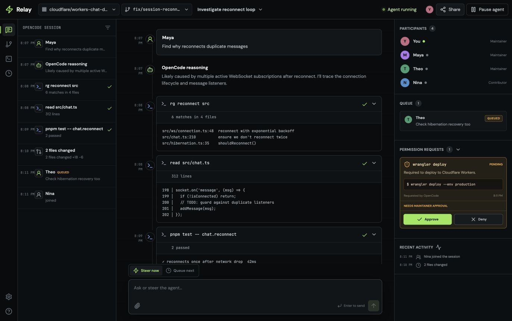

# Relay

Relay is a multiplayer coding-agent room built on Cloudflare Durable Objects, OpenCode Workerd, and Railway Sandboxes. One Durable Object owns one shared room and OpenCode session; a persistent per-room Railway sandbox supplies the Linux filesystem and shell.



## Vision

Relay exists to make collaborative software development with AI agents as natural as pair programming. We envision a world where:

- **Teams code together with agents in real time** — no more copying prompts between chat windows or losing context when switching tools. Everyone sees the same agent, the same transcript, and the same repository state.
- **Agents are first-class collaborators** — not black boxes that run in isolation. Participants can steer, pause, or queue follow-ups at any moment, and every tool call is visible and auditable.
- **The environment is the workspace** — a persistent, shared Linux sandbox means the agent has the same capabilities as a human: read, write, search, run tests, start servers. No toy environments, no limited toolsets.
- **Git is the source of truth** — every session pins to a commit, every change is tracked, and pull requests emerge naturally from the collaboration. No manual syncing, no drift.
- **Handoff is seamless** — move from local development to preview deployment to production without losing the room, the agent session, or the transcript. The room is the stable identity; the client is ephemeral.

Relay is infrastructure for this workflow: a durable room primitive that composes OpenCode, a sandbox, and Git into a single collaborative loop.

## What works

- Shared, ordered OpenCode session events and tool transcripts
- Real-time presence across multiple browser tabs or devices
- Immediate steering or queued follow-up prompts
- Dangerous always-allow tool execution with every side effect retained in the transcript
- Persistent room snapshots for late joiners
- Public GitHub repository selection, exact commit pinning, and durable native OpenCode workspaces
- Per-user GitHub OAuth and one-click pull request creation from the shared overlay
- Automatic updates to one room PR, exact-commit preview tracking, and seamless room handoff to the deployed build
- Persistent, isolated shell and file tools through Railway Sandboxes
- Responsive transcript, people, and queue views
- Local simulation mode for development without provider credentials
- Live OpenRouter model selection with NVIDIA Nemotron 3 Ultra Free and per-room persistence

## Architecture

```text
React client
  ├─ Production or stateless preview build
  ├─ One-time room handoff ticket
  ├─ GitHub OAuth + revision publishing
  └─ WebSocket to the stable Relay control plane
       └─ AgentRoom Durable Object (one per room name)
            ├─ Relay SQLite tables: room, events, participants, permissions
            ├─ Commit-pinned GitHub snapshot + mutable PR overlay
            ├─ Embedded OpenCode Workerd runtime + persistent session state
            ├─ Hibernating WebSocket fan-out
            └─ Per-room Railway Sandbox
                 ├─ Repository at `/workspace/repository`
                 ├─ Remote read/edit/write/search/shell tools
                 └─ Persistent disk and detachable shell sessions
```

Relay and OpenCode keep their durable state in the room Durable Object. OpenCode tool calls cross one explicit boundary into the room's Railway sandbox, whose ID is stored with the room. Relay records a compact, UI-focused event projection while retaining raw OpenCode payloads. After each turn, it mirrors the Git change set into the Durable Object overlay for recovery and pull-request creation.

The Durable Object is the stable room authority even when the browser moves to a preview deployment. Preview builds are stateless Workers: after Relay verifies that a preview serves the exact published commit and room protocol, every participant receives a short-lived, one-time handoff ticket. The deployed client reconnects to the original room, preserving the transcript, presence, queue, workspace, and OpenCode session.

Cloudflare's Agents SDK was considered for `useAgent`, but it is intentionally not layered on top: its client requires the Agents SDK server protocol and would introduce a second agent state model. Relay keeps OpenCode authoritative and uses a small room-specific WebSocket protocol instead.

## Develop

Requirements: Node.js 22+, pnpm, and Wrangler.

```bash
pnpm install
pnpm dev
```

Open [http://127.0.0.1:5173/r/reconnect-loop](http://127.0.0.1:5173/r/reconnect-loop). Join as another participant with query parameters:

```text
http://127.0.0.1:5173/r/reconnect-loop?name=Sam&role=contributor
```

## Repository workspaces

Production clones the exact selected commit into a per-room Railway sandbox. The Durable Object also stores the mutable text-file overlay, so a replacement sandbox can be rehydrated without losing shared changes. Simulation mode retains the Workers-native GitHub snapshot backend and needs no Railway credentials.

New rooms start from [`aranlucas/multiplayer-chat@main`](https://github.com/aranlucas/multiplayer-chat/tree/main). Maintainers can select a different public GitHub repository and branch from the header.

OpenCode runs inside the room Durable Object using the official Workerd SDK. Relay replaces OpenCode's local filesystem tools with Railway-backed `read`, `glob`, `grep`, `edit`, `write`, and `shell` tools. Their paths are restricted to `/workspace/repository`; shell commands run in that same isolated Linux environment.

Every turn reconnects to the room's sandbox, restores the exact pinned commit plus the durable overlay when necessary, and resumes the OpenCode session stored in the Durable Object. Ignored dependency directories and package caches survive between turns while the sandbox remains active. Railway credentials stay in the Worker secret store and are never sent to the browser or model.

## Railway Sandbox

Create a Railway project token scoped to the production environment, then configure it as a Worker secret:

```bash
npx wrangler secret put RAILWAY_TOKEN
pnpm deploy
```

`RAILWAY_ENVIRONMENT_ID`, region, and idle timeout are ordinary variables in `wrangler.jsonc`. The idle timeout can be 1–120 minutes. The room reconnects to the same sandbox across Worker requests; if Railway has already retired it, Relay creates a replacement and reapplies the Durable Object overlay. For local live mode, put the same variables in `.dev.vars`. No long-running runner, tunnel, Docker image, or separate Railway service is required.

## GitHub pull requests

The **Connect GitHub** button uses GitHub's web OAuth flow with the `public_repo` scope. Relay encrypts the resulting access and refresh tokens into an HTTP-only, secure, same-site cookie; tokens are never exposed to client JavaScript, OpenCode, or Railway. Pull request creation uses the authenticated user's GitHub permissions.

Register a GitHub OAuth app with this production callback:

```text
https://relay-multiplayer-agent.aranlucas.workers.dev/api/auth/github/callback
```

Set `GITHUB_OAUTH_CLIENT_ID` in `wrangler.jsonc`, then store the client and cookie-encryption secrets in Workers:

```bash
npx wrangler secret put GITHUB_OAUTH_CLIENT_SECRET
openssl rand -hex 32 | npx wrangler secret put GITHUB_SESSION_SECRET
```

When a room has shared file changes, **Create PR** writes Git blobs and a deletion-aware tree on top of the room's pinned commit, creates a uniquely named `relay/…` branch, and opens the pull request against the selected base branch. If the authenticated user cannot push to the upstream repository, Relay creates or reuses that user's fork first. Relay stores the credential encrypted with `GITHUB_SESSION_SECRET`; later successful turns append commits to the same PR automatically. Each commit becomes an immutable room revision and starts deployment observation.

## Seamless preview handoff

Relay uses two deployment surfaces because Cloudflare does not generate normal preview URLs for Workers that implement Durable Objects:

- `wrangler.jsonc` deploys the stable control plane and production client.
- `preview/wrangler.jsonc` deploys the stateless preview client.

Configure Cloudflare Workers Builds for non-production branches with this deploy command:

```bash
pnpm deploy:preview
```

The preview build requires these build variables/secrets:

```text
RELAY_CONTROL_ORIGIN=https://relay-multiplayer-agent.aranlucas.workers.dev
RELAY_DEPLOYMENT_WEBHOOK_SECRET=<same secret configured on the control Worker>
```

Workers Builds supplies `WORKERS_CI_BRANCH` and `WORKERS_CI_COMMIT_SHA`. The publish script uploads a preview alias, waits for `/__relay/ready` to report that exact SHA, and calls the stable control plane. Relay then broadcasts the ready revision and moves connected participants to the deployed version. A later deployment on the same preview origin activates the revision and reloads the room; a versioned preview on a different origin uses a one-time ticket.

The complete two-origin flow can be tested without GitHub or OAuth:

```bash
pnpm dev:e2e --host 127.0.0.1
pnpm dev:preview --host 127.0.0.1

curl -X POST http://127.0.0.1:5176/api/rooms/local-loop/local-preview \
  -H 'Content-Type: application/json' \
  --data '{"previewURL":"http://127.0.0.1:5174","commitSHA":"local-preview"}'
```

Open `http://127.0.0.1:5176/r/local-loop` before calling the local-preview endpoint. The browser will move to port 5174 while its WebSocket remains attached to the room on port 5176.

## Live OpenCode mode

Relay ships with an in-room model picker configured for NVIDIA Nemotron 3 Ultra through OpenRouter:

| Display name | Model ID |
| --- | --- |
| NVIDIA Nemotron 3 Ultra (free) | `openrouter/nvidia/nemotron-3-ultra-550b-a55b:free` |

`OPENCODE_MODEL` supplies the bootstrap default for new rooms and is checked in as NVIDIA Nemotron 3 Ultra Free. `OPENCODE_MODEL_ALLOWLIST` controls which live catalog entries Relay offers. Maintainers can change the selection from the room header; Relay persists it per room and switches the existing OpenCode session on its next turn. The `:free` OpenRouter route does not charge credits, but it remains subject to OpenRouter and upstream availability and rate limits.

To run the free model live locally, copy the example configuration and add the Railway and OpenRouter credentials:

```bash
cp .dev.vars.example .dev.vars
# Set OPENCODE_MODE=live plus Railway and provider credentials in .dev.vars.
pnpm dev
```

Relay configures OpenCode's native permission wildcard to `allow`. This is dangerous mode with side effects contained in the Railway sandbox: repository edits do not pause for maintainer approval, while tool inputs, outputs, and resulting diffs remain visible and persistent to every participant. The Pause action interrupts OpenCode and terminates active Railway shell commands.

## Verify and deploy

```bash
pnpm typecheck
pnpm test
pnpm build
pnpm build:preview
pnpm deploy
```

Deployed app: [relay-multiplayer-agent.aranlucas.workers.dev](https://relay-multiplayer-agent.aranlucas.workers.dev)

The generated UI concepts are retained in [`design/`](design/) and the browser-verified implementation screenshots are in [`artifacts/`](artifacts/).
