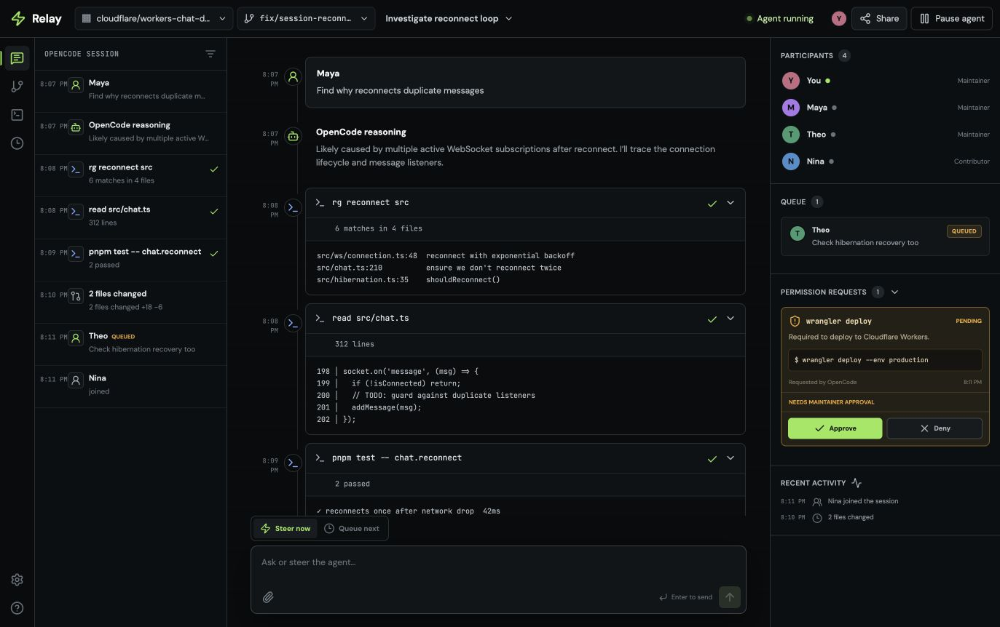
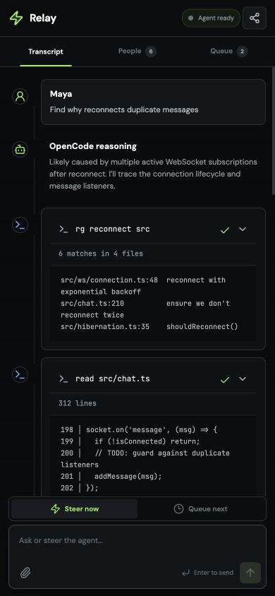

# Relay

[](https://github.com/aranlucas/multiplayer-chat/actions/workflows/ci.yml)
[](LICENSE)

## Bring the whole room into the coding loop.

Relay is a multiplayer coding-agent room. Share one link, watch an ordered OpenCode event stream, steer the agent or queue the next turn, review permissions and diffs together, and publish an exact-commit preview or pull request from the same repository workspace. It is a room for the moment when “the agent is working” needs to become something a team can actually see and shape.





The images above are local product captures. They show the transcript, participants, queued prompts, permission review, and responsive mobile room layout.

## How it works

- A Cloudflare Durable Object owns each room’s state and SQLite-backed event history.
- One OpenCode Workerd host runs inside the room. Prompts can be sent immediately (**Steer**) or held for the next turn (**Queue**).
- A Railway Sandbox provides the persistent, isolated repository workspace used by shell/file tools.
- Participants receive presence, transcript, diff, question, queue, permission, planning, and revision updates over the room connection.
- GitHub OAuth can publish room changes to a pull request. Revisions track commit SHA, preview status, provider, and activation.
- Preview handoff verifies the target readiness endpoint and room protocol before a revision is activated.

## Run locally

Requirements: Node.js 24, pnpm, and a Cloudflare/Wrangler-compatible development environment.

```bash
corepack enable
pnpm install --frozen-lockfile
cp .dev.vars.example .dev.vars
pnpm dev
```

The Vite + Cloudflare plugin starts the local Worker and UI. The example variables select deterministic `simulation` mode, so a local room does not need OpenRouter or Railway credentials. Open the local URL printed by Vite and use the reconnect demo at `/r/reconnect-loop` to exercise a room.

To use the live OpenCode path, set `OPENCODE_MODE=live` and provide the matching provider key (`OPENROUTER_API_KEY`, `OPENCODE_ZEN_API_KEY`, or `CLOUDFLARE_API_TOKEN`), a Railway token/API token, and `RAILWAY_ENVIRONMENT_ID`. `OPENCODE_MODEL` and `OPENCODE_MODEL_ALLOWLIST` select the permitted model IDs. GitHub OAuth is only needed for pull-request publication.

OpenRouter can optionally run through [Cloudflare AI Gateway](https://developers.cloudflare.com/ai-gateway/usage/providers/openrouter/). Set `CLOUDFLARE_AI_GATEWAY_ID` to an existing gateway slug and `CLOUDFLARE_ACCOUNT_ID` to its account ID; keep `OPENROUTER_API_KEY` and the `openrouter/` model IDs. For an authenticated gateway, also provide `CLOUDFLARE_AI_GATEWAY_TOKEN` as a secret with gateway Run permission. The example variables document these options. Invalid gateway configuration is reported by `/api/health` and rejected at runner initialization.

Gateway requests log usage metadata, skip response caching, and require provider credentials rather than falling back to Unified Billing. Prompt and response bodies are excluded from gateway logs by default. Set `CLOUDFLARE_AI_GATEWAY_LOG_PAYLOADS=true` to opt into payload logging. This integration tags traffic as `application=relay`; it does not attribute inference to individual participants. Content classification and task analysis may require payload logging and further gateway settings.

## Verify

```bash
pnpm lint
pnpm format:check
pnpm typecheck
pnpm test
pnpm build
```

The same commands are required by CI. Tests include the Preview publisher's CLI and HTTP integration checks. CI also runs `pnpm build:preview` to verify the native Preview build. `pnpm dev:e2e` starts the browser-oriented Vite/Cloudflare configuration on port 5176; its `e2e/cloudflare.config.ts` uses simulation mode. The repository does not currently define a `test:e2e` script.

## Deploy

```bash
pnpm deploy
```

This builds the Worker and runs `cf deploy --prebuilt` with the generated `.cloudflare/output` build output. Cloudflare credentials and live-mode secrets must be configured in the target environment. Branch publication uses native [Worker Previews](https://developers.cloudflare.com/workers/previews/) under the same `relay-multiplayer-agent` Worker:

```bash
pnpm deploy:preview
```

Production and previews share `vite.config.ts`. The preview build uses the pinned plugin's `cf-vite build --preview --mode relay-preview` command to set native Preview metadata; the publisher runs `cf previews deploy --prebuilt --mode relay-preview` for the CI branch. The generated `.cloudflare/output/v0/config.json` must record `buildContext.isPreview: true` and mode `relay-preview`. Selecting the Vite mode alone does not mark the output as a native Preview build. Provide `WORKERS_CI_BRANCH` and `WORKERS_CI_COMMIT_SHA` (or `GITHUB_HEAD_REF` and `GITHUB_SHA`). The production branch is skipped. Every branch gets a native Preview, and branches named `relay/<room>--<suffix>` also report their deployment to that room.

Room callbacks require `RELAY_CONTROL_ORIGIN` and the secret `RELAY_DEPLOYMENT_WEBHOOK_SECRET`, matching the production Worker's callback secret. The publisher reads Cloudflare's structured deployment result, verifies the immutable deployment URL against the exact commit and room protocol, then reports that URL and the deployment ID. It does not use the mutable branch URL for room revisions.

Previews serve the UI and readiness endpoint, and participants continue connecting to the existing production room service. They do not bind an isolated `AGENT_ROOMS` namespace, so a handoff retains the room's participants, transcript, and unsent draft. Preview URLs are public unless Cloudflare Access is configured.

Configure Workers Builds on `relay-multiplayer-agent` as follows:

| Target              | Build command            | Deploy command                     |
| ------------------- | ------------------------ | ---------------------------------- |
| Production (`main`) | `pnpm run build`         | `pnpm exec cf deploy --prebuilt`   |
| Previews (enabled)  | `pnpm run build:preview` | `node scripts/publish-preview.mjs` |

Set the room callback variables in the Previews build settings. The separate `relay-multiplayer-preview` Worker and its production-branch build are no longer used for new publications. Existing version URLs can remain available for historical revisions while its redundant build connection is retired.

Production configuration enables [Workers Issues](https://developers.cloudflare.com/workers/observability/issues/) and [Workers traces](https://developers.cloudflare.com/workers/observability/traces/) at a 10% sampling rate, with URL query strings redacted. These settings take effect on the next deployment. Automatic RPC spans connect API calls to room Durable Objects; traces use the Workers observability event quota and pricing. The [October 2026 Cloudflare review](docs/cloudflare-announcement-review.md) explains the adopted features and the larger migration candidates.

## Source map

| Path                                                  | Responsibility                                                                                                                        |
| ----------------------------------------------------- | ------------------------------------------------------------------------------------------------------------------------------------- |
| `src/client/`                                         | Landing page, room UI, responsive navigation, connection state, GitHub controls, and event presentation.                              |
| `src/server/agent-room.ts`                            | Durable Object room lifecycle, event persistence/broadcast, permissions, planning, workspace revisions, and pull-request publication. |
| `src/server/embedded-opencode.ts`, `opencode.ts`      | OpenCode Workerd host and provider/model configuration.                                                                               |
| `src/server/railway-sandbox.ts`, `railway-tools.ts`   | Per-room Railway workspace and tool bridge.                                                                                           |
| `src/server/workspace.ts`                             | Repository clone, edits, commits, and changed-file tracking.                                                                          |
| `src/server/github-auth.ts`, `github-pull-request.ts` | GitHub OAuth session and pull-request publication.                                                                                    |
| `src/shared/`                                         | Room protocol, exact-edit helpers, text normalization, and workspace-change contracts.                                                |
| `cloudflare.config.ts`                                | Durable Object, asset, compatibility, and production variable configuration.                                                          |
| `artifacts/`                                          | Local desktop/mobile/native event captures used in this README and design review.                                                     |

## Status

Relay is an active prototype with a deterministic local simulation path and a live Cloudflare/Railway path. The live path depends on external provider, sandbox, OAuth, and deployment configuration; the repository’s unit tests and local simulation do not prove those external services are available.
